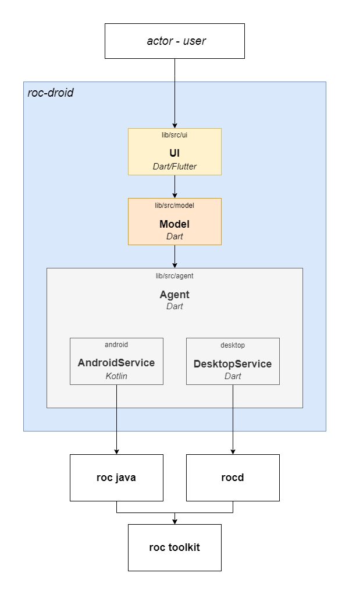

# Application architecture description

**Table of contents:**

- [Application architecture description](#application-architecture-description)
  - [Architecture overview](#architecture-overview)
  - [Description of modules](#description-of-modules)

## Architecture overview

roc-droid is responsible for implementing and managing the functionality of the roc-toolkit logic in the form of an application.

The roc-droid implementation is comprised of three modules:

* **UI** – (lib/src/ui): This module is responsible for rendering the user interface and handling user interactions with the application functionality.

* **Model** – (lib/src/model): This module contains all the primary classes and entities necessary for updating the visual display of the graphical interface.

* **Agent** – (lib/src/agent): This module manages client interaction with the core logic of the roc-toolkit.

## Description of modules

The roc-droid modules are described in the following documents:

* **UI** – [User interface architecture description](/docs/architecture_ui.md)

* **Model** – [Model architecture description](/docs/architecture_model.md)

* **Agent** – [Agent architecture description](/docs/architecture_agent.md)